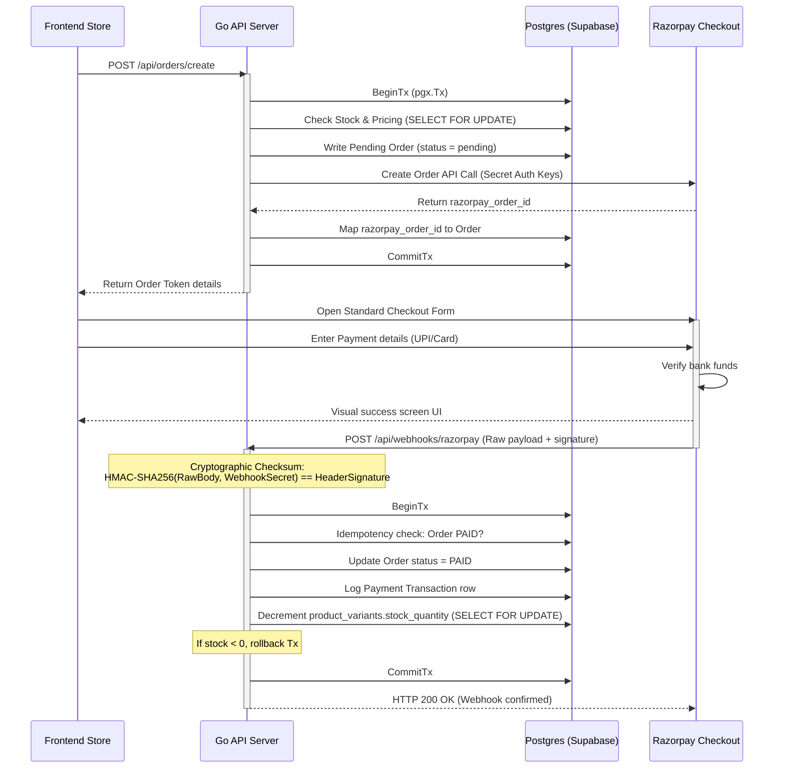

# Crochet E-Commerce Store Backend - Go / Gin / pgx / sqlc

Production-ready backend for cute e-commerce crochet storefront. Built in Go using Gin routing framework, sqlc PostgreSQL queries compiler, and pgx v5 transaction pool driver. Integrates authentication logic, server-side database price matching, ACID transaction stock decrements, and Razorpay standard checkout.

---

## 🛠️ Secure Order & Payment Webhook Flow



---

## 🧪 Local Webhook Testing Guide using Ngrok

Payment gateways (like Razorpay) cannot send payment webhook notifications to a `localhost` URL. To verify webhook triggers locally on your machine during development:

### Step 1: Fire up the Go server locally
1. Launch the server (running on port `3000` by default):
   ```bash
   go run cmd/api/main.go
   ```

### Step 2: Establish a secure public tunnel via Ngrok
1. Run Ngrok to forward port 3000 to the public web:
   ```bash
   ngrok http 3000
   ```
2. Ngrok will assign a unique public forwarding address:
   `https://f438-12-34-56-78.ngrok-free.app`

### Step 3: Configure Webhook in Razorpay Test Mode
1. Log in to your [Razorpay Dashboard](https://dashboard.razorpay.com/) and verify you are in **Test Mode** (the header should show yellow).
2. Go to **Settings > Webhooks > Add New Webhook**.
3. Set the **Webhook URL** to your Ngrok tunnel forwarding endpoint:
   `https://f438-12-34-56-78.ngrok-free.app/api/webhooks/razorpay`
4. Set a custom string as the **Secret** (e.g. `my_secret_webhook_passphrase`).
5. Under **Active Events**, select:
   - `order.paid`
   - `payment.captured`
6. Click **Create Webhook**.

### Step 4: Configure environment configurations
Configure your local `.env` variables to match the settings:
```bash
RAZORPAY_WEBHOOK_SECRET="my_secret_webhook_passphrase"
```
Once configured, test pay on standard checkout using test methods (e.g. UPI or test cards). Razorpay will notify your API backend, validating payment, reserving stock, and generating transactions in Supabase automatically!
